<div align="center">
  
# ⚡ SkillDeck

### One catalog. Six tools. The skill that's actually worth installing.

<br>

<p align="center">
  
  
  
  
</p>

</div>

<br>

<p align="center">
  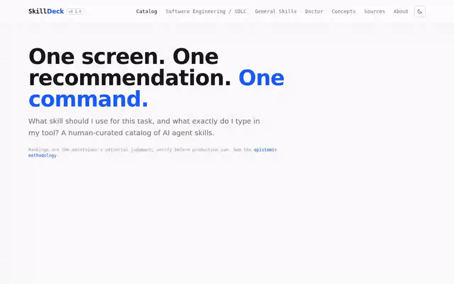
</p>

<p align="center"><sub>17 seconds, real interactions, no cuts. Prefer full quality? <a href="media/skilldeck-demo.mp4">watch the MP4</a>.</sub></p>

<br>

> There are hundreds of AI agent skills scattered across GitHub, written for six different tools, with no way to tell the maintained ones from the abandoned forks. SkillDeck reads all of them, removes the duplicates, ranks what's left, and hands you the one skill worth installing — with the exact command for whatever tool you use.

<br>

---

## ✨ See It In Action

<table>
<tr>
<td width="50%" valign="top">
<p align="center">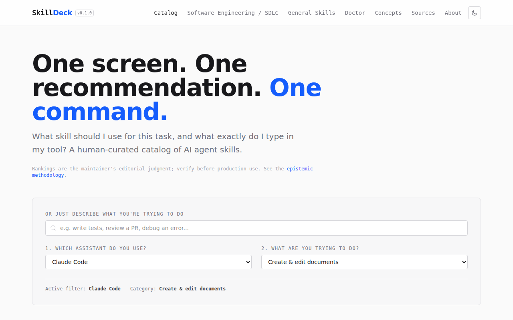</p>
<p><b>Describe the task. Get the skill.</b><br/>Pick your tool and what you're trying to do — or just type it in plain English — and the catalog narrows to one recommendation, with a ready-to-paste prompt.</p>
</td>
<td width="50%" valign="top">
<p align="center">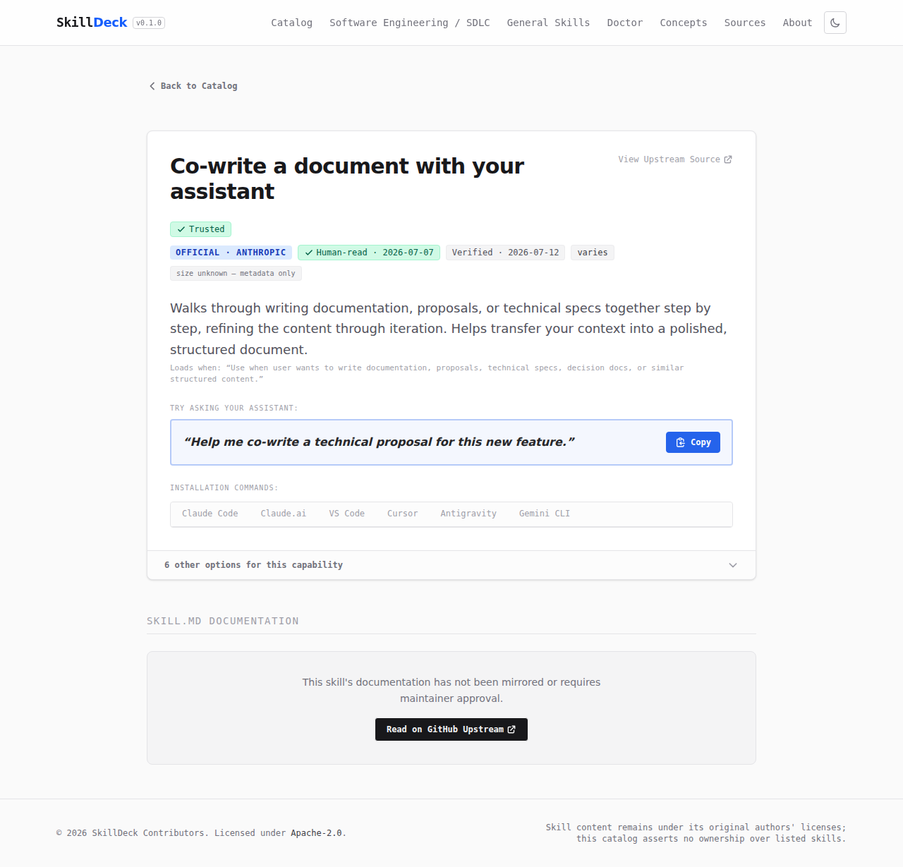</p>
<p><b>Not just a skill. Proof it's trustworthy.</b><br/>Provenance, license, human-review status, and the install command for every supported tool — all on one page, before you copy anything.</p>
</td>
</tr>
<tr>
<td width="50%" valign="top">
<p align="center">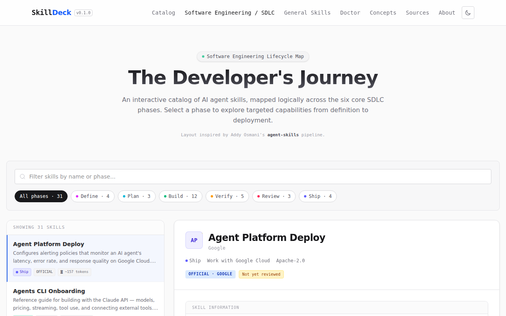</p>
<p><b>Your build, mapped end to end.</b><br/>Every software-engineering skill placed where it actually belongs in the lifecycle — Define, Plan, Build, Verify, Review, Ship.</p>
</td>
<td width="50%" valign="top">
<p align="center">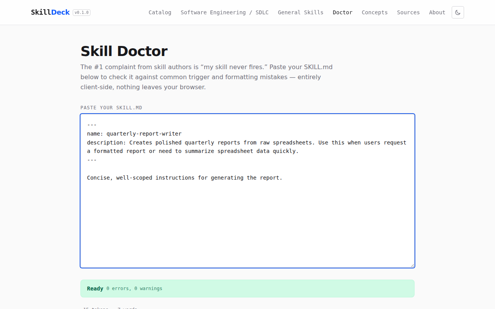</p>
<p><b>Paste it. Know in seconds.</b><br/>Skill Doctor lints your own <code>SKILL.md</code> against the mistakes that keep skills from firing — entirely client-side, nothing leaves your browser.</p>
</td>
</tr>
<tr>
<td width="50%" valign="top">
<p align="center">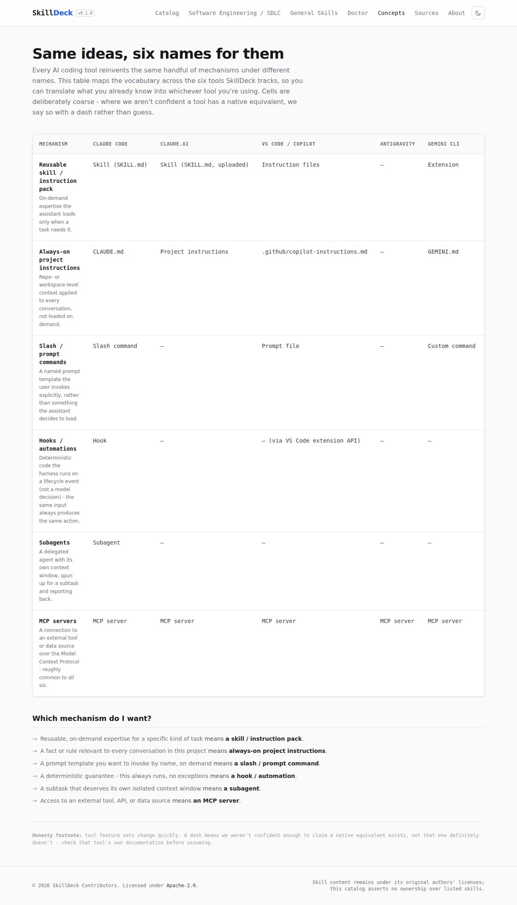</p>
<p><b>Six tools, six vocabularies. One Rosetta Stone.</b><br/>A "hook" in Claude Code is a VS Code extension API call — and doesn't exist at all in three of the others. This page translates what you already know into whatever tool you're using today.</p>
</td>
<td width="50%" valign="top">
<p align="center">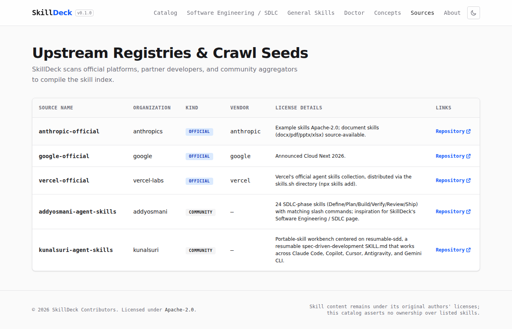</p>
<p><b>Nothing here we can't point back to.</b><br/>Every skill traces to a real upstream repository — official, partner, or community — never a mystery package.</p>
</td>
</tr>
</table>

<br>

---

> [!TIP]
> **What is a SKILL?** A skill file is a reusable instruction package — a set of instructions, knowledge, and workflows that gives an AI agent a specific capability. In other words, it tells an AI agent how to perform a specific task consistently. The goal is consistency, reusability, and avoiding repeated prompts.

<br>

## 🎯 The Goal

Every agent framework can learn new skills now — Claude Code, Antigravity, VS Code Copilot, Gemini CLI, and whatever ships next. That part was easy.

The hard part: hundreds of skills, scattered across GitHub, in six incompatible formats, with no way to tell a maintained one from an abandoned fork. **SkillDeck solves that once, centrally** — deduplicated, ranked by provenance, verified by a human — instead of making every developer solve it again in every repo they touch.

<br>

---

## 🍳 The Architecture: "Just Eat the Soup"

We divide the codebase into a clean separation of concerns, ensuring that the production deployment remains lightweight, secure, and fast:

<p align="center">
  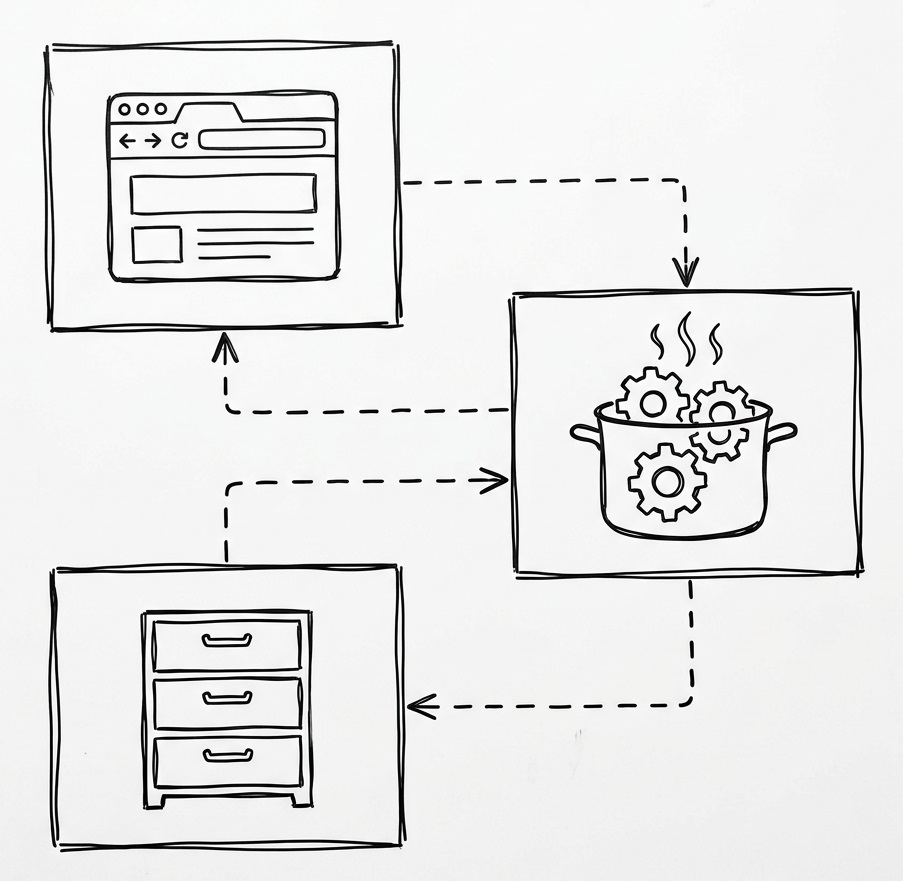
</p>

> [!TIP]
> **Looking for a different aesthetic?** Click the button below to toggle the high-tech glossy style:
> <details>
>   <summary><b>🎨 Toggle High-Tech Architecture Style</b> 🔽</summary>
>   <p align="center">
>     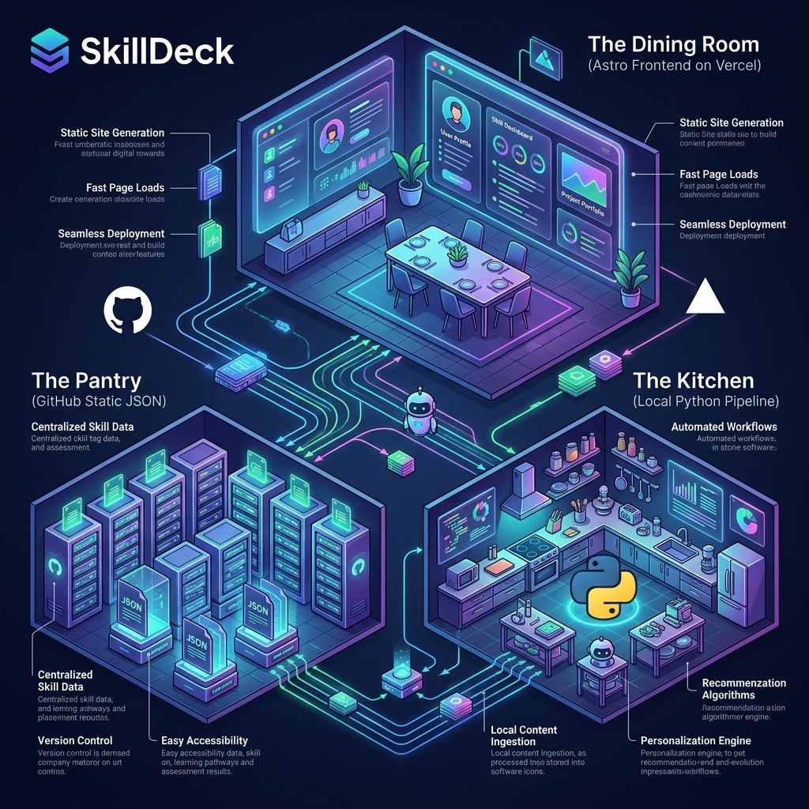
>   </p>
> </details>

<br>
  
* **🍽️ The Dining Room (Vercel Frontend):** The user-facing Astro website is hosted on Vercel. It is built to be extremely light and performant. There is no runtime database, and no resource-heavy Python or LLM pipelines run in production. Users simply **"eat the soup"** by browsing pre-built, static skill pages and search indices.

* **🍳 The Kitchen (Local Pipeline):** All heavy lifting — ingesting raw skills, computing MinHash signatures for deduplication, running capability clustering via an agent, generating card content, and human curation — happens in the local development environment (the **"Kitchen"**).

* **📦 The Pantry (GitHub):** The final, curated, and promoted skills are stored as static JSON files under [`data/`](data/). The pipeline now writes one **`skill-<source-id>.json`** file per source (e.g., `skill-anthropic-official.json`, `skill-google-official.json`) rather than a single monolithic `skills.json`, making diffs clean and targeted. [`data/kb.json`](data/kb.json) is the final output read by the Vercel frontend. When changes are pushed to GitHub, Vercel pulls this data to compile the static pages.

<br>

---

## ⚙️ How it works: The Pipeline

To achieve this goal, SkillDeck implements a robust, multi-stage offline data pipeline called the **Kitchen**. Headquartered in the [kitchen/](kitchen) module and controlled via [cli.py](kitchen/cli.py), the pipeline processes raw metadata files and refines them into a polished database.

<p align="center">
  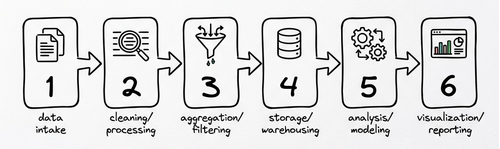
</p>

> [!TIP]
> **Looking for a different aesthetic?** Click the button below to toggle the high-tech glossy style:
> <details>
>   <summary><b>🎨 Toggle High-Tech Pipeline Style</b> 🔽</summary>
>   <p align="center">
>     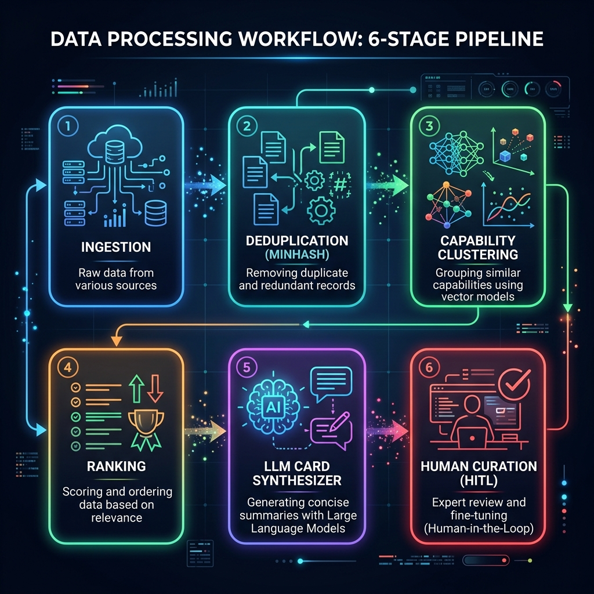
>   </p>
> </details>

<br>

<details>
<summary><b> Click Here to Expand: Detailed Pipeline Info </b> 🔽</summary>

### 1. Ingestion & Canonicalization

* **Ingestion:** The pipeline fetches raw `SKILL.md` files and associated metadata from various sources (GitHub orgs, partner lists, and user registries). A robust **GitHub client** ([`utils.py`](kitchen/utils.py)) handles ETag-based disk caching, rate-limiting, and exponential-backoff retries so unchanged blobs are never re-fetched.
* **Canonicalization:** Aggregator references are resolved to their true origin repositories, establishing clear ownership and source links.
* **Per-source file storage:** Skills are now written to individual `data/skill-<source-id>.json` files (one per source), replacing the old monolithic `data/skills.json`. This makes Git diffs precise and enables parallel updates from different sources.

### 2. Deduplication (MinHash)

* Using **MinHash** algorithms and Jaccard similarity thresholds, the pipeline identifies near-duplicate skills. This prevents redundant packages or exact forks from cluttering the registry.

### 3. Capability Clustering

* Skills are grouped into logical capabilities (e.g., Documents, Cloud Ops, Data Analysis, Frontend, Testing, Planning, Agent Building) by an **agent, not a downloaded model**. `python -m kitchen cluster-prepare` writes the skills needing a capability to a JSON file; the agent running the [`/skilldeck-ingest`](.claude/commands/skilldeck-ingest.md) command reads it, decides each capability, and `python -m kitchen cluster-apply` writes the result back. No embedding model, no network call beyond GitHub.

### 4. Ranking

* Within each cluster, skills are ranked using a scoring system based on their provenance (Official vs. Partner vs. Community) and metadata depth.

### 5. Explainer Card Writer

* The same agent-driven pattern writes structured, clean "Explainer Cards": `python -m kitchen cards-prepare` writes the skills needing a card, the agent writes the copy, and `python -m kitchen cards-apply` validates and caches it (no `LLM_API_KEY`, no scripted API call). Each card synthesizes complex skill metadata into a readable structure:
  * **Title:** Concise name of the skill.
  * **What it does:** Standardized description of capabilities.
  * **Try saying:** Sample prompts or user commands to invoke the skill.

</details>

<br>

---

## 👥 How it works: Human Verification & Curation

AI-generated cards are only the starting point. To guarantee the highest standards of safety, accuracy, and utility, SkillDeck integrates a **Human-in-the-Loop (HITL) Curation System** coded in [review.py](kitchen/review.py).

<p align="center">
  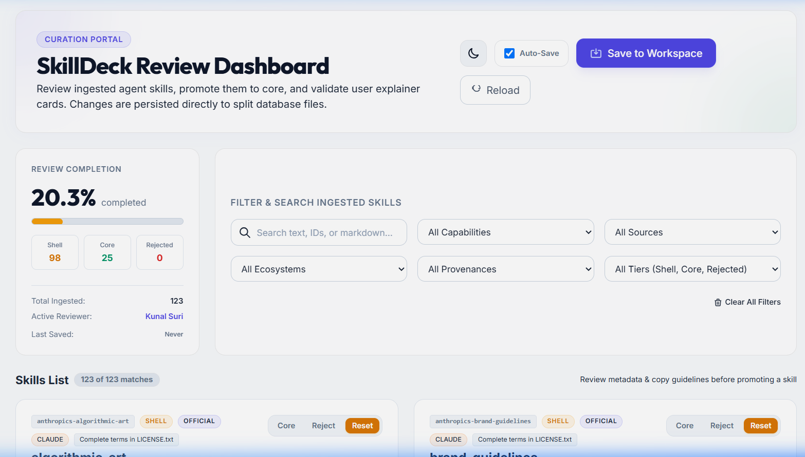
</p>
<p align="center"><em>Review Dashboard: live stats (123 skills ingested, 25 promoted to Core), multi-axis filters, and reviewer identity — all in light mode.</em></p>

```
[Ingested Skills] ──> [Agent Writes Cards] ──> [Review Queue] ──> [Human Verifier] ──> [Core Database]
                                                                          │
                                                                          └─── [Promote / Edit Card / Reject]
```

<br>

<details>
<summary><b> Click Here to Expand: Detailed Info on Human-Verified Curation </b> 🔽</summary>


### The Curation Flow

<br>

1. Ingested skills enter the system as `"shell"` tier entries.

<br>

2. Maintainers can use either the **CLI** or the new **Web Review Portal**:

   **Option A — CLI review:**

   ```bash
   python -m kitchen review <skill_id>
   ```

   <br>
  
   The interactive CLI displays the skill's origin, license, metadata, and frontmatter, renders the agent-written explainer card, and offers options to **promote**, **edit**, **reject**, or **skip**.

   **Option B — Web Review Portal:**

   ```bash
   python -m kitchen review --web
   ```

  <br>

   Launches a local HTTP server at `http://127.0.0.1:8000/` and opens the **SkillDeck Curation & Review Portal** ([`audit/audit.html`](audit/audit.html)) in your browser. The portal exposes a rich visual interface with:
   * Full skill list with tier/provenance badges and search/filter controls
   * Inline explainer card editor (title, what-it-does, try-saying)
   * One-click promote / reject controls with stamped audit trail
   * Live re-emit of `data/kb.json` on every save
   * Dark/light theme toggle, localhost-only security guard

  <br>

   <p align="center">
     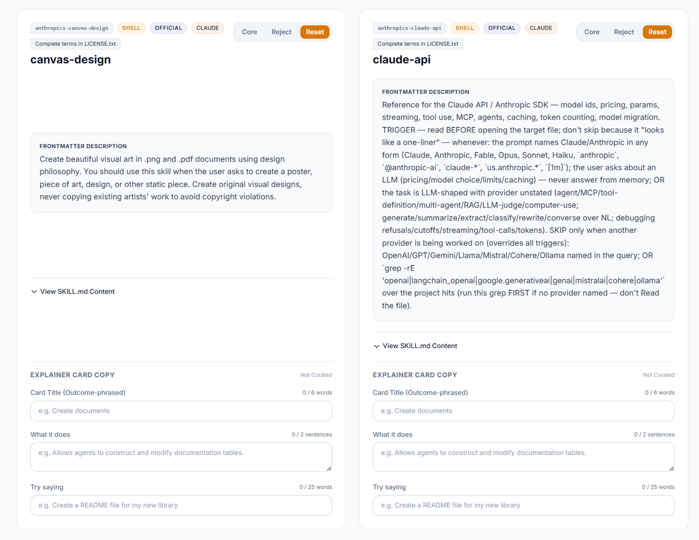
   </p>
   <p align="center"><em>Skill list: each card shows its ID, tier badge (Shell/Core), provenance (Official/Community), ecosystem, and frontmatter description.</em></p>

  <br>
  
3. Promoting a skill upgrades it to `"core"` and marks it with the verifier's Git username, ISO timestamp, and upstream commit SHA. Rejected skills are cataloged with reasons and excluded from publication.

</details>

<br>

> [!NOTE]
> The web portal is served by a built-in Python `http.server` and is intentionally **localhost-only** — it refuses to render on any non-local hostname. It is never deployed to Vercel.

<br>

---

## 🏗️ Data Storage: Per-Source Skill Files

The pipeline now uses a **distributed, per-source file layout** under `data/` instead of a single `skills.json`:

| File | Description |
|---|---|
| `data/skill-anthropic-official.json` | Skills from Anthropic's official repositories |
| `data/skill-google-official.json` | Skills from Google's official repositories |
| `data/skill-vercel-official.json` | Skills from Vercel's official repositories |
| `data/kb.json` | Final compiled knowledge base (read by the Vercel frontend) |

Key properties of this layout:

* **Atomic writes** — every file is written via a temp-then-rename (`atomic_write_json`) to prevent partial reads.
* **Idempotent ingest** — unchanged blobs (matched by `blob_sha`) are skipped, preserving reviewed/promoted metadata across runs.
* **Auto-cleanup** — obsolete source files are automatically deleted when a source is removed from `sources.json`.
* **Backward-compatible** — a legacy `skills.json` (if it exists) is read and migrated automatically, then deleted.

<br>

---

## 🚀 Deployment

The front-end website is built using **Astro v4** (within [site/](site)) and outputs static web pages optimized for visual excellence, performance, and SEO.

> [!NOTE]
> **Vercel Integration:** SkillDeck is pre-configured via [vercel.json](vercel.json) for production builds on Vercel. A deployment pipeline is coming soon, publishing the verified skill deck directly to the Vercel web app!

<br>

## 🛠️ Local Development

### 1. Prerequisites

Ensure you have Python 3.11+ and Node.js 18+ installed on your machine.

### 2. Quick Start (Windows PowerShell)

We provide automated scripts to configure your environment and launch the services:

* **Setup dependencies and build:**
  
  On Windows:
  ```powershell
  .\scripts\win\dev-setup.ps1
  ```
  On Linux/macOS:
  ```bash
  ./scripts/linux/dev-setup.sh
  ```
  
  *(See scripts: [dev-setup.ps1](scripts/win/dev-setup.ps1) / [dev-setup.sh](scripts/linux/dev-setup.sh))*

* **Run local development server:**
  
  On Windows:
  ```powershell
  .\scripts\win\dev-run.ps1
  ```
  On Linux/macOS:
  ```bash
  ./scripts/linux/dev-run.sh
  ```
  
  *(See scripts: [dev-run.ps1](scripts/win/dev-run.ps1) / [dev-run.sh](scripts/linux/dev-run.sh))*

### 3. Pipeline Commands

The easiest way to run everything — including capability clustering and
card writing, which are done by the agent itself, not a downloaded model or
an LLM API call — is the **`/skilldeck-ingest`** command in a Claude Code
session with `GITHUB_TOKEN` set. See
[`.claude/commands/skilldeck-ingest.md`](.claude/commands/skilldeck-ingest.md).

You can also interact with the Python kitchen pipeline stage by stage:

<br>

<details>
<summary><b> Click Here to Expand: Detailed Info on Python-based Kitchen Pipeline </b> 🔽</summary>


* **Run the scriptable stages (ingest → canonicalize → dedup → rank):**

  ```bash
  python -m kitchen pipeline
  ```

* **Capability clustering (agent-driven):**

  ```bash
  python -m kitchen cluster-prepare   # writes .kitchen_cache/cluster_input.json
  # ... an agent reads it and writes .kitchen_cache/cluster_output.json ...
  python -m kitchen cluster-apply
  ```

* **Card writing (agent-driven):**

  ```bash
  python -m kitchen cards-prepare     # writes .kitchen_cache/cards_input.json
  # ... an agent reads it and writes .kitchen_cache/cards_output.json ...
  python -m kitchen cards-apply
  ```

* **Review the queue of skills (CLI):**
  
  ```bash
  python -m kitchen review --queue
  ```

* **Verify a specific skill (CLI):**
  
  ```bash
  python -m kitchen review <skill_id>
  ```

* **Launch the Web Review Portal:**
  
  ```bash
  python -m kitchen review --web
  # Opens http://127.0.0.1:8000/ in your browser
  ```

* **Emit frontend database:**
  
  ```bash
  python -m kitchen emit
  ```

* **Check upstream freshness for core skills:**
  
  ```bash
  python -m kitchen freshness
  ```

### 4. Running Tests

```bash
python -m pytest kitchen/tests/
```

Tests cover the full pipeline, per-source DB split/merge/cleanup (`test_utils_db.py`), CLI argument routing (`test_cli.py`), and all stage modules. No network calls are made — the GitHub client is mocked throughout.

</details>

<br>

---

## 📄 Acknowledgments & License

The **SkillDeck** project is open-source and licensed under the [Apache License 2.0](LICENSE) — Copyright © 2026 Kunal Suri ([@kunalsuri](https://github.com/kunalsuri)) (CEA LIST).

<br>

**Warranty & Liability Notice**: This software is provided under the Apache License 2.0 on an "AS IS" basis, without warranties or conditions of any kind, either express or implied. To the extent permitted by the license and applicable law, the authors and contributors disclaim warranties and limit liability. Please refer to the LICENSE file for the complete terms, including Sections 7 (Disclaimer of Warranty) and 8 (Limitation of Liability). See the LICENSE file for the full license text.

